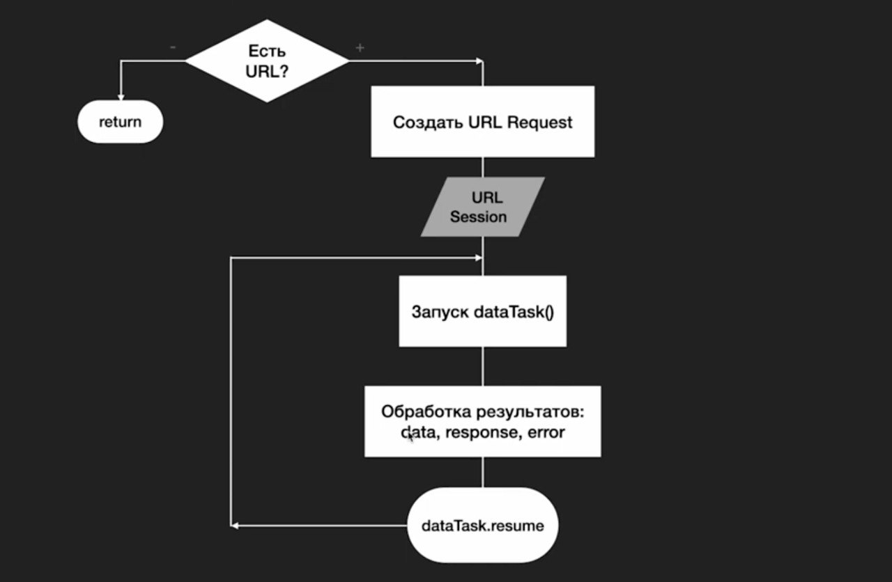

# Приложение "Drink recipies" #

 Главный компонент ContentView который отображает список из рецептов.

```swift
struct ContentView
```


## Сетевой слой приложения ##
```swift
class Network: ObservableObject
```
Сетевой слой приложения реализован с помощью класса Network, который является наблюдаемым объектом (ObservableObject). Этот класс отвечает за получение данных из сети и их декодирование в объекты Swift.

Класс Network содержит следующие элементы:

Свойство recipes типа [Recipe], которое содержит список рецептов, полученных из сети. Это свойство помечено как @Published, что означает, что оно автоматически обновляется при изменении значения.
Метод getRecipe(), который выполняет сетевой запрос к API сайта https://www.thecocktaildb.com/ для получения рецептов маргариты. Этот метод использует класс URLSession для выполнения сетевого запроса и класс JSONDecoder для декодирования полученных данных в объекты Swift.
 


 
